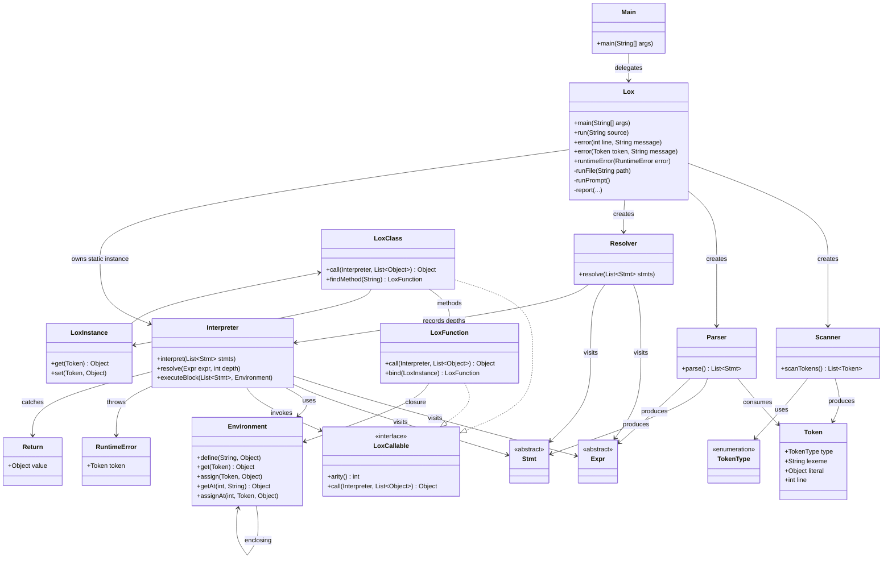

# jlox Class Map

## Class Relationships



## Package Layout

```mermaid
flowchart LR
    subgraph com.lox
        Lox
        Main
        Scanner
        Parser
        Resolver
        Interpreter
        Environment
        Token
        TokenType
        Expr
        Stmt
        LoxCallable
        LoxFunction
        LoxClass
        LoxInstance
        RuntimeError
        Return
    end

    subgraph com.tool
        GenerateAst
    end

    com.tool --> com.lox : generates Expr.java, Stmt.java
```
