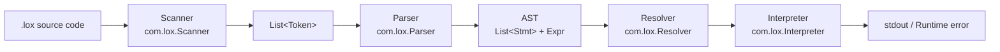
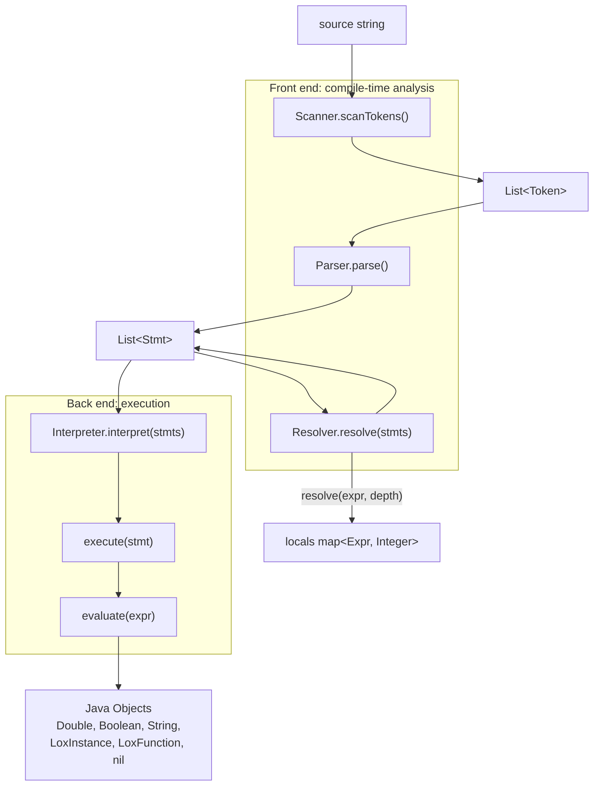
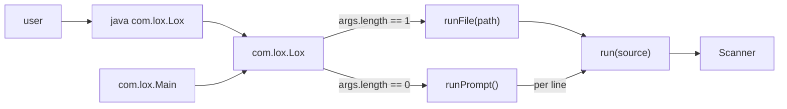
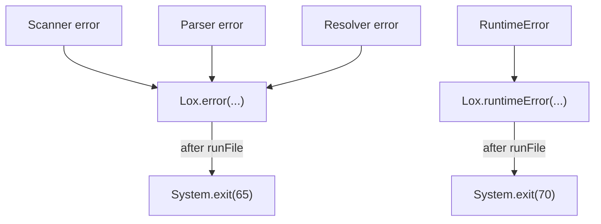

# jlox Program Paths

This diagram shows how a Lox source program travels through the interpreter.

## Execution Pipeline

```mermaid
flowchart LR
    Source[".lox source code"]
    Scanner["Scanner<br/>com.lox.Scanner"]
    Tokens["List&lt;Token&gt;"]
    Parser["Parser<br/>com.lox.Parser"]
    AST["AST<br/>List&lt;Stmt&gt; + Expr"]
    Resolver["Resolver<br/>com.lox.Resolver"]
    Interpreter["Interpreter<br/>com.lox.Interpreter"]
    Output["stdout / Runtime error"]

    Source --> Scanner
    Scanner --> Tokens
    Tokens --> Parser
    Parser --> AST
    AST --> Resolver
    Resolver --> Interpreter
    Interpreter --> Output
```

## Detailed Passes

```mermaid
flowchart TD
    subgraph FrontEnd ["Front end: compile-time analysis"]
        S1["Scanner.scanTokens()"]
        S2["Parser.parse()"]
        S3["Resolver.resolve(stmts)"]
    end

    subgraph BackEnd ["Back end: execution"]
        I1["Interpreter.interpret(stmts)"]
        I2["execute(stmt)"]
        I3["evaluate(expr)"]
    end

    Source["source string"] --> S1
    S1 --> Tokens["List&lt;Token&gt;"]
    Tokens --> S2
    S2 --> Stmts["List&lt;Stmt&gt;"]
    Stmts --> S3
    S3 --> Stmts
    S3 -->|"resolve(expr, depth)"| Locals["locals map&lt;Expr, Integer&gt;"]
    Stmts --> I1
    I1 --> I2
    I2 --> I3
    I3 --> Values["Java Objects<br/>Double, Boolean, String,<br/>LoxInstance, LoxFunction, nil"]
```

## Entry Points

```mermaid
flowchart LR
    User["user"]
    CLI["java com.lox.Lox"]
    Main["com.lox.Main"]
    Lox["com.lox.Lox"]
    RunFile["runFile(path)"]
    RunPrompt["runPrompt()"]
    Run["run(source)"]

    User --> CLI
    CLI --> Lox
    Main --> Lox
    Lox -->|"args.length == 1"| RunFile
    Lox -->|"args.length == 0"| RunPrompt
    RunFile --> Run
    RunPrompt -->|"per line"| Run
    Run --> Scanner
```

## Error Paths

```mermaid
flowchart TD
    ScannerError["Scanner error"]
    ParserError["Parser error"]
    ResolverError["Resolver error"]
    RuntimeError["RuntimeError"]
    LoxError["Lox.error(...)"]
    LoxRuntimeError["Lox.runtimeError(...)"]
    Exit65["System.exit(65)"]
    Exit70["System.exit(70)"]

    ScannerError --> LoxError
    ParserError --> LoxError
    ResolverError --> LoxError
    LoxError -->|"after runFile"| Exit65
    RuntimeError --> LoxRuntimeError
    LoxRuntimeError -->|"after runFile"| Exit70
```
